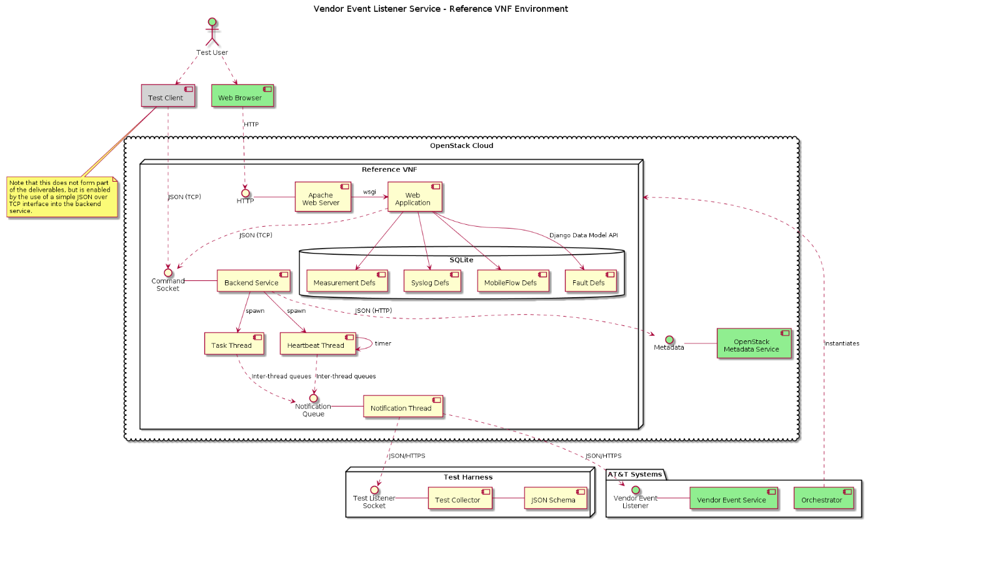

# AT&T Vendor Event Listener Service Reference VNF - Application Note


## Introduction

### Background

The VNF described in this Application Note is intended to provide a mechanism to 
stimulate the service API described in "AT&T Service Specification - Service: Vendor Event Listener Revision 1.61, 13-Nov-2015".

### Purpose

This Application Note is intended to enable the reader to understand three aspects of the Fault and Measurement Reporting Reference VNF ("Reference VNF"):

1.  How the Reference VNF has been realized in terms of software design

    The intention is that AT&T, or other vendors, can adapt the software in order to explore the operation of the reporting APIs.

2.  How to install the Reference VNF

    The Reference VNF has been developed in an OpenStack environment and
    should be straightforward to instantiate from the image provided. It
    is also possible to install the software in other Linux or
    Windows environments.

3.  How to use the Reference VNF

    The Reference VNF provides a number of capabilities and separate
    components which can be used to explore the operation of the Vendor
    Event Listener API.


## Realization

The realization of the Reference VNF is written in Python and the web 
application is built using the Django framework (https://www.djangoproject.com). 
The overall system architecture is shown in Figure 1 and comprises three key 
deliverables:

1.  The web-application itself.

2.  A Backend service.

3.  A validating test collector application.

These are described in more detail in the following sections. As it
    is delivered, the database is populated with some basic Faults and
    Measurements representative of those that might be raised by a
    virtual SBC.

Figure 1: Realization Architecture



Note that items shown in green in the diagram are existing AT&T systems and do 
not form part of the delivery.

### Web Application

The web application is written using the Django web framework and
    provides two key functions:

-   A user interface, which enables the user to manage event definitions
    and invoke the generation of those events.
    
    -  Faults
    -  Measurements
    -  Mobile Flow events
    -  Syslog events

-   A database to store definitions of events.

#### Web Interface

The web interface provides the following views:

-   A "landing" page which explains the operation of the system and
    provides navigation to the other views.

-   An administration view that enables the user to create and modify
    the definitions for events.

-   Views which lets the user specify a profile of events to be raised.

-   A view which lets the user manage the lifecycle of the VNF.

Whenever a user invokes the generation of one or more events, the profile for 
the activity is packaged into a JSON object and sent over a socket to the 
co-located backend server. See [Backend Service](#backend) for further details. 

#### Data Model

The Django framework's data-modelling capabilities have been used to
    specify the schema of the database. Measurements and Faults are
    modelled independently - the small amount of common data in the
    Event Header has not been factored out into a common table.

The various "array" fields in the Faults and Measurements are
    modelled as separate tables for:

-   Additional Information

-   Additional Measurement Groups

-   Codecs in Use

-   Features in Use

-   File System Usage

-   Latency Distribution

-   VNIC Usage

-   CPU Usage

The API schema defines two-levels of linked object from:

Measurement → Additional Measurement Group → Fields

This has not been represented by two separate tables as
    "normal-form" would require but instead up to four "fields"
    (name-value pairs) have been defined in the Additional Measurement
    Group table. This enables the inbuilt admin views to manage the
    tables. Note that this restriction only applies to event
    definitions stored in the database - the interface into the backend
    service does not suffer this restriction, so external clients could
    generate bigger arrays of fields inside Additional
    Measurement Groups.

Also note that Django's admin views don't readily support "nest-inline"
    views onto related tables.

<span id="backend" class="anchor"/>
### Backend Service

The backend service is run as a daemon under the control of the
    systemd subsystem. It listens for commands on a TCP socket and then
    spawns a separate worker-thread to handle each valid command.

Commands can run for (very) long periods (*e.g.* sending large
    numbers of events at slow rates) so delegating each separate task to
    a thread enables the backend server to remain responsive for
    new commands. As a result, it's possible to model complex scenarios,
    such as regular periodic statistic reports and superimposed bursts
    of faults.

The interface to the Vendor Event Listener is handled by a separate
    notification thread. Note that this has the side-effect that a
    single VNF will serialize requests to the Vendor Event Listener
    service - this may or may not be desirable behavior in terms of
    stressing the collector function.

The backend service also provides a "heartbeat" function, raising
    events containing just the Event Header with the domain set
    to heartbeat.

The backend service should run (and restart automatically) whenever
    the VNF is running. It may be restarted manually by systemctl:

```
# systemctl restart backend
```

The backend service maintains the concept of the VNF State and
    reports the state in every event. If the state of the event changes,
    then it will generate a gratuitous heartbeat event (*i.e.*
    asynchronous with the regular heartbeats) to notify the collector of
    the state change.

Figure 2: VNF State Machine


<span id="collector" class="anchor"/>
### Validating Collector

The validating collector provides a basic test capability for
    the Reference VNF. The application implements the Vendor Event
    Listener API providing:

-   Logging of new requests.

-   Validating requests against the published schema.

-   Validating the credentials provided in the request.

-   Responding with a 402 No Content for valid requests.

-   Responding with a 401 Unauthorized error response-code and a JSON
    exception response for failed authentication.

The use of the Test Collector is described more fully in the 
"AT&T Vendor Event Listener Service Reference VNF - User Guide".

## Installation

### Overview

The target environment for the Reference VNF is clearly an OpenStack
    VM instance. However, the software has been written so that it will
    run in other environments, too. Indeed, the minimal installation
    will run on a Windows PC with the web client, web server, web
    application, backend service and test collector all running on the
    same PC.

-   Installation of the source code, required for standalone operation,
    is described in [Source Code Installation](#SCI).

-   Installation of the QCOW2 image to directly instantiate a VM in an
    OpenStack environment is described in [Orchstraction](#Orchestration) with the internal
    filesystem layout of the VM's disk volume described in [VNF Filesystem Layout](#VNFFS).

<span id="SCI" class="anchor"/>
### Source Code Installation

The source code is not required if the user just wishes to use the
    supplied Reference VNF - see [Orchestration](#Orchestration) for that case.

The source code is provided as a zipped tarfile it should simply be
    unzipped into a suitable folder in the desired development
    environment (Linux or Windows). It contains the following folders:

-   &lt;INSTALL\_DIR&gt;/bldobs

    A Makefile for Gnu make which automates a number of tasks, such as
    copying code to a testbed environment.

-   &lt;INSTALL\_DIR&gt;/code

    Source code for webserver, backend and collector functions.

-   &lt;INSTALL\_DIR&gt;/config

    Example config files for both backend and collector.

-   &lt;INSTALL\_DIR&gt;/docs

    Project documentation, including this *Application Note*.

-   &lt;INSTALL\_DIR&gt;/hot

    Heat orchestration templates and environment files.

<span id="Orchestration" class="anchor"/>
### Orchestration

The Reference VNF is supplied as a QCOW2 image and can be instantiated
    either "manually" or as a Heat stack. In either case, the necessary
    steps may be undertaken using the OpenStack CLI tools or using the
    Horizon web-GUI. Describing the operation of the OpenStack tools is
    outside the scope of this document, but the following sections
    describe logically what needs to be configured to instantiate the
    Reference VNF.

#### Image

The image is provided in QCOW2 format.

It is based on *CentOS Linux release 7.1.1503 (Core)*.

The QCOW2 image should be imported into the Glance database of images.

#### Heat Template

A simple Heat template is provided in the packaged source code which
    instantiates the Reference VNF using the m1.small flavor.

An example of the corresponding environment file is also provided.

The files are in the packaged source-code at:

-   &lt;installdir&gt;/hot

The supplied environment file should be copied and the parameters
    edited to reflect how you wish the instances to be named and
    managed:
```
parameters:
    function_code: rfvf
    function_instance: "0001"
    vm_instance: "001"
    component_name: ref
    component_instance: "001"
    bootimage: 40299aa3-2921-43b0-86b9-56c28a2b5232
    key_name: my-keyname
    mgmt_network: 84985f60-fbba-4a78-ba83-2815ff620dbc
    mgmt_ip_address: 172.18.152.200
    vel_domain: 127.0.0.1
    vel_port: 30000
    vel_path:
    vel_topic_name:
    vel_username:
    vel_password:

```

The meaning of these parameters is:

**function\_code  
function\_instance  
vm\_instance  
component\_name  
component\_instance**  

The sub-fields within the VM name according to AT&T's naming convention.

**bootimage**

The UUID of the image in the Glance database. Once the supplied QCOW2 image has been uploaded into Glance determine its UUID.

**key\_name**

The name of your SSH public key as uploaded into OpenStack. You retain the corresponding private key and use it to authenticate over SSH to the instance as the user centos.

**mgmt\_network**

The UUID of the management network. Determine from OpenStack.

**vel\_domain**

The FQDN or IP address of the Vendor Event Listener API.

In this example, the instance is running a co-located test-collector [Test Collector](#collector) at:

http://**127.0.0.1**:30000/vendor\_event\_listener/eventListener/v1

**vel\_port**

The port for the Vendor Event Listener API.

In this example, the instance is running a co-located test-collector [Test Collector](#collector) at:

http://127.0.0.1:**30000**/vendor\_event\_listener/eventListener/v1

**vel\_path**

A fixed path prefix for the Vendor Event Listener API.

In this example, the instance is running a co-located test-collector [Test Collector](#collector) at:

http://127.0.0.1:30000/**vendor\_event\_listener**/eventListener/v1

**vel\_username**

The username to be used to authenticate to the Vendor Event Listener API.

**vel\_password**

The password to be used to authenticate to the Vendor Event
    Listener API. Note that the storage of the password in plaintext
    clearly means that there is a minimal level of security in
    this case.

#### User Authentication

Access to the instance is via SSH as the user centos.

The user is expected to provide a reference to an existing SSH
    key-pair when the Reference VNF is instantiated via the environment
    file for the Heat template.

Having created an SSH public/private key-pair, the public key is
    uploaded into OpenStack and referenced by the key\_name parameter in
    the Heat environment file.

The private key is retained (and kept secret!) and used by the SSH
    client when accessing the instances as the user centos.

<span id="VNFFS" class="anchor"/>
### VNF Filesystem Layout

This section describes the file-system layout in the VM instance
    created from the supplied QCOW2 image. This information is provided
    for reference and no installation steps are necessary in order to
    create this structure beyond instantiating the VNF from the
    QCOW2 image.

#### Executables

The executable files - Python scripts and assorted Django resources - are installed under:

-   /opt/att/website

-   /opt/att/backend

-   /opt/att/collector

Files are owned by root but do not gain any elevated privileges.

#### Database

The database is stored in:

-   /var/opt/att/website

The directory and the file need to be accessible to the Apache
    HTTP daemon. SELinux imposes restrictions on access to files by
    httpd so the security-context of the file and directory is set
    to httpd\_sys\_content\_t.

<span id="VNFconfig" class="anchor"/>
#### Configuration

Configuration for the backend and collector applications is stored in:

-   /etc/opt/att

The configuration files are commented with information regarding the function of the configuration options.

The configuration of the backend service to run as a daemon under
    the control of system is stored in:

-   /etc/systemd/system/backend.service

#### Logging

Log files are stored in:

-   /var/log/att

The location can be modified in the configuration files.

The verbosity is controlled by the command-line invocation. For the
    backend service, this means it is controlled through the
    backend.service file used by systemd [VNF Config](#VNFconfig) to change
    the file). The version delivered in the QCOW2 image defaults
    to "verbose".

The files are rotated so their size will not grow in an
    uncontrolled manner.

## Usage

### Web Application

The use of the Reference VNF has been moved into a separate document -
    see the "AT&T Vendor Event Listener Service Reference VNF - User Guide".

### Backend Server

The backend server should not need any user control during normal
    operation since it is started as a daemon automatically by systemd
    and should restart if it fails.

However, it can be run manually as a foreground process, either on a
    Linux platform or a Windows PC. It is invoked with a number of
    command-line arguments:

```
C:> python backend.py --config <file>
                      --section <section>
                      --verbose
```

Where:

**config** defines the path to the config file to be used.

**section** defines the section in the config file to be used.

**verbose** controls the level of logging to be generated.

### Test Collector

The use of the Test Collector function delivered along with the
    Reference VNF has been moved into a separate document -
    see "AT&T Vendor Event Listener Service Reference VNF - User Guide".
