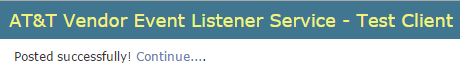

# AT&T Vendor Event Listener Service - Reference VNF - User Guide

Introduction
============

Background
----------

This document describes how to use the web application to stimulate
the service API described in "AT&T Service Specification, Service: 
Vendor Event Listener Revision 2.0, 12-Feb-2016". 

Purpose
-------

This User Guide is intended to enable the reader to understand how
    the web application can be used to explore the operation of the
    Vendor Event Listener API.


Realization
===========

The realization of the Reference VNF is written in Python 
    and the web application is built
    using the Django framework (https://www.djangoproject.com). 
    The overall system architecture is shown in Figure 1 and comprises 
    three key deliverables:

*    The web-application itself.

*    A Backend service.

*    A validating test collector application.

The web application is described in more detail in the
    following sections. As it is delivered, the database is populated
    with some basic Faults and Measurements representative of those that
    might be raised by a virtual SBC together with some dummy Mobile
    Flow and Syslog events.

The other two components are described in separate documents:

*    Reference VNF Application Note

*    Test Collector User Guide

Figure 1: Realization Architecture


Note that items shown in green in the diagram are existing AT&T
    systems and do not form part of the delivery.

Web Application
---------------

The web application is written using the Django web framework and
    provides two key functions:

-   A user interface, which enables the user to manage event definitions
    and invoke the generation of those events.

-   A database to store definitions of Measurement, Fault, Mobile Flow
    and Syslog events.

### Web Interface

The web interface provides the following views:

-   A "landing" page which explains the operation of the system and
    provides navigation to the other views.

-   An administration view that enables the user to create and modify
    the definitions for Faults and Measurements.

-   A view which lets the user specify a profile of Faults to be raised.

-   A view which lets the user specify a profile of Measurements to
    be raised.

-   A view which lets the user specify a profile of Mobile Flow events
    to be raised.

-   A view which lets the user specify a profile of Syslog events to
    be raised.

-   A view which lets the user manage the lifecycle of the VNF.

Whenever a user invokes the generation of one or more events (either
    Faults or Measurements) the profile for the activity is packaged
    into a JSON object and sent over a socket to the co-located
    backend server.

### Data Model

The Django framework's data-modelling capabilities have been used to
    specify the schema of the database. Measurements and Faults are
    modelled independently - the small amount of common data in the
    Event Header has not been factored out into a common table.

The various "array" fields in the Faults and Measurements are
    modelled as separate tables for:

-   Additional Information

-   Additional Measurement Groups

-   Codecs in Use

-   Features in Use

-   File System Usage

-   Latency Distribution

-   VNIC Usage

-   CPU Usage

The API schema defines two-levels of linked object from:

Measurement → Additional Measurement Group → Fields

This has not been represented by two separate tables as
    "normal-form" would require but instead up to four "fields"
    (name-value pairs) have been defined in the Additional Measurement
    Group table. This enables the inbuilt admin views to manage the
    tables. Note that this restriction only applies to event
    definitions stored in the database - the interface into the backend
    service does not suffer this restriction, so external clients could
    generate bigger arrays of fields inside Additional Measurement Groups.

Also note that Django's admin views don't readily support "nest-inline"
    views onto related tables.

Validating Collector
--------------------

The validating collector provides a basic test capability for
    the Reference VNF. The application implements the Vendor Event
    Listener API providing:

-   Logging of new requests.

-   Validating requests against the published schema.

-   Validating the credentials provided in the request.

-   Responding with a 402 No Content for valid requests.

-   Responding with a 401 Unauthorized error response-code and a JSON
    exception response for failed authentication.

It is intended to be used in environments where the "real" AT&T
    Vendor Event Listener service is not available in order to test the
    Reference VNF or, indeed, any other software which needs to send
    events to a server.

Using the Web Application
=========================

Landing Page
------------

The web application is accessed by HTTP at:

```
http://<INSTANCE_IP>/
```

(This redirects to http://*<*INSTANCE_IP*>*/reporting/ to allow for future elaboration.)

The "landing-page" provides navigation to the various views.

Figure 2: Web Application - Administration main page


To return to the ‘Landing’ page at any time, select "View site" on
    the page header bar:
    


Or use the


option on the event generation forms.

Administration View
-------------------

The delivery includes a default administrator account:

-   Username: admin

-   Password: Au4EVNF

The user name and password can be changed in the admin interface.

Individual user accounts can be provisioned, for example using ATTUIDs.

Figure 3: Web Application - Administrator Login


The administration views are all located under:

    http://<INSTANCE\_IP>/admin/

The administration pages allow the user to add/modify definitions of
    Faults and Measurements.

Figure 4: Web Application - Administration main page


Fault Creation, Deletion and Modification
-----------------------------------------

Once logged in, the various event types can be created, modified
    and deleted.

This can be accessed using the administration page ‘Faults’ options.


Selecting ‘Faults’ or ‘Change’ will take the user to a list of the
    defined events.

Multiple deletes can be achieved by using the check boxes at the
    start of each row, and Selecting *Delete Selected Faults…* from the
    drop down list.

Figure 5: Web Application - Multiple event deletion


You will be expected to confirm this action before the selected
    events are deleted.

Figure 6: Web Application - Multiple event deletion - Confirmation


Selecting any of the events will allow the user to modify the fields
    of that event. The save options are at the bottom of the page.

Figure 7: Web Application - Fault administration page


You may also delete from here. Again, you must provide confirmation.

Figure 8: Web Application - Fault delete confirmation page


To return to the ‘Landing’ page select *View site* on the page
    header bar


Fault Definition
----------------

To create a new fault, select *add* from the Administration page or
    *Add Fault* from the Faults page.

This will show a page where the various fault field can be set. The
    required fields will be defaulted to a value.

Where fields form part of an array of valued (i.e. Additional
    Information Fields) there is an option to add another set of fields
    to the array.

Figure 9: Web Application - Fault administration page


Fault Generation
----------------

The Fault generation view can be accessed via the *Generate
    events*→*Faults* option on the Landing page.

The view allows the user to generate one or more of the defined
    fault events at a set rate.

Figure 10: Web Application - Fault generation page


Once the events have been sent, confirmation of success or failure
    will be displayed.




Measurement, MobileFlow and Syslog Definition
---------------------------------------------

These events are all defined in exactly the same way as Faults, with
    each page enabling the user to create the fields appropriate to each
    respective event type.

Measurement, MobileFlow and Syslog Generation
---------------------------------------------

These events are all generated in the same way as Faults, with each
    page enabling events of the appropriate kind to be generated.

Lifecycle Management
--------------------

The lifecycle management view is accessed using the VNF Lifecycle
    option on the landing page.

This page allows the user to trigger the Reference VNF to transition
    through the state **Preparing to Terminate** to **Ready to
    Terminate** and then back again to **Active**.

Figure 11: Web Application - Lifecycle management page


The state-machine implemented by the backend service will go through
    the state-transitions defined in Figure 12.

Figure 12: VNF State Machine


    
    
Each transition by the state-machine will result in a gratuitous
    Heartbeat event to the event listener service.

Clearing the Event Counter.
---------------------------

On various pages throughout the application is a counter of the
    total number of Events generated.

Figure 13: Event counter


This counter is reset to 0 using the 'Clear the Event counter' on
    the Landing page.

Note: there is no request for confirmation - selecting this option
    will clear the counter

Using the Validating Collector
==============================

The test collector can be run manually, either on a Linux platform
    or a Windows PC. It is invoked with a number of command-line
    arguments:

```
  C:> python collector.py --config <file>
                          --section <section>
                          --verbose
```

Where:

  -  **config** defines the path to the config file to be used.

  -  **section** defines the section in the config file to be used.

  -  **verbose** controls the level of logging to be generated.

Wherever you chose to run the Test Collector, note that the
    configuration of the backend service running on the VM generating
    the events has to match so that the events generated by the backend
    service are sent to the correct location and the Test Collector is
    listening on the correct ports and URLs. The relevant section of the
    Test Collector config file is:
    
```
    #------------------------------------------------------------------------------
    # Details of the Vendor Event Listener REST service.
    #
    # REST resources are defined with respect to a ServerRoot:
    # ServerRoot = https://{Domain}:{Port}/{optionalRoutingPath}
    #
    # REST resources are of the form:
    # * {ServerRoot}/eventListener/v{apiVersion}
    # * {ServerRoot}/eventListener/v{apiVersion}/{topicName}
    # * {ServerRoot}/eventListener/v{apiVersion}/eventBatch
    #
    # The "vel\_topic\_name" parameter is used as the "topicName" element in the path
    # and may be empty.
    #
    # Note that the path, if present, should have no leading "/" but should have a
    # training "/".
    #------------------------------------------------------------------------------
    vel_domain = 127.0.0.1
    vel_port = 30000
    vel_path = vendor_event_listener/
    vel_username = Alice
    vel_password = This isn't very secure!
    vel_topic_name = example_vnf
```
The equivalent section of the backend service's configuration has to
    match, or the equivalent parameters injected in the VM by the
    OpenStack metadata service have to match.

When events are sent from the web application, the results of the
    validation will be displayed on stdout and be written to the log
    file specified in the configuration file.

For example: A Fault event failing to validate:

```
    <machine name>; - - [29/Feb/2016 10:58:28] "POST
    /vendor_event_listener/eventListener/v1/example_vnf HTTP/1.1" 204  0
    Event is not valid against schema! 'eventSeverity' is a required
    property
    Failed validating 'required' in
    schema['properties']['event']['properties']['faultFields']:
        {'description': 'fields specific to fault events',
        'properties': {'alarmAdditionalInformation': {'description':'additional alarm information',
                                                      'items': {'$ref': '#/definitions/field'},
                                                      'type': 'array'},
                       'alarmCondition': {'description': 'alarm condition reportedby the device',
                                                      'type': 'string'},
                       'alarmInterfaceA': {'description': 'card, port, channel or interface name of the device generating the alarm',
                                                      'type': 'string'},
                       'eventSeverity': {'description': 'event severity or priority',
                                         'enum': ['CRITICAL',
                                                   'MAJOR',
                                                   'MINOR',
                                                   'WARNING',
                                                   'NORMAL'],
                                         'type': 'string'},  
                       'eventSourceType': {'description': 'type of event source',
                                           'enum': ['other(0)',
                                                     'router(1)',
                                                     'switch(2)',
                                                     'host(3)',
                                                     'card(4)',
                                                     'port(5)',
                                                     'slotThreshold(6)',
                                                     'portThreshold(7)',
                                                     'virtualMachine(8)'],
                                           'type': 'string'},
                       'faultFieldsVersion': {'description': 'version of the faultFields block',
                                              'type': 'number'},
                       'specificProblem': {'description': 'short description of the alarm or problem',
                                              'type': 'string'},
                       'vfStatus': {'description': 'virtual function status enumeration',
                                    'enum': ['Active',
                                              'Idle',
                                              'Preparing to terminate',
                                              'Ready to terminate',
                                              'Requesting termination'],
                                    'type': 'string'}},
            'required': ['alarmCondition',
                          'eventSeverity',
                          'eventSourceType',
                          'specificProblem',
                          'vfStatus'],
            'type': 'object'}
    On instance['event']['faultFields']:
        {'alarmAdditionalInformation': [{'name': 'extra information',
                                          'value': '2'},
                                         {'name': 'more information',
                                          'value': '1'}],
         'alarmCondition': 'alarm condition 1',
         'eventSourceType': 'virtualMachine(8)',
         'faultFieldsVersion': 1,
         'specificProblem': 'problem 1',
         'vfStatus': 'Active'}
    Bad JSON body decoded:
    {
        "event": {
            "commonEventHeader": {
                "domain": "fault",
                "eventId": "6",
                "eventType": "event type 1",
                "functionalRole": "unknown",
                "lastEpochMicrosec": 1456743510381000.0,
                "priority": "Normal",
                "reportingEntityId": "Not in OpenStack",
                "reportingEntityName": "Not in OpenStack Environment",
                "sequence": 0,
                "sourceId": "Not in OpenStack",
                "sourceName": "Not in OpenStack Environment",
                "startEpochMicrosec": 1456743510381000.0,
                "version": 1
            },
            "faultFields": {
                "alarmAdditionalInformation": [
                    {
                        "name": "extra information",
                        "value": "2"
                    },
                    {
                        "name": "more information",
                        "value": "1"
                    }
               ],
               "alarmCondition": "alarm condition 1",
               "eventSourceType": "virtualMachine(8)",
               "faultFieldsVersion": 1,
               "specificProblem": "problem 1",
               "vfStatus": "Active"
            }
        }
    }
```
